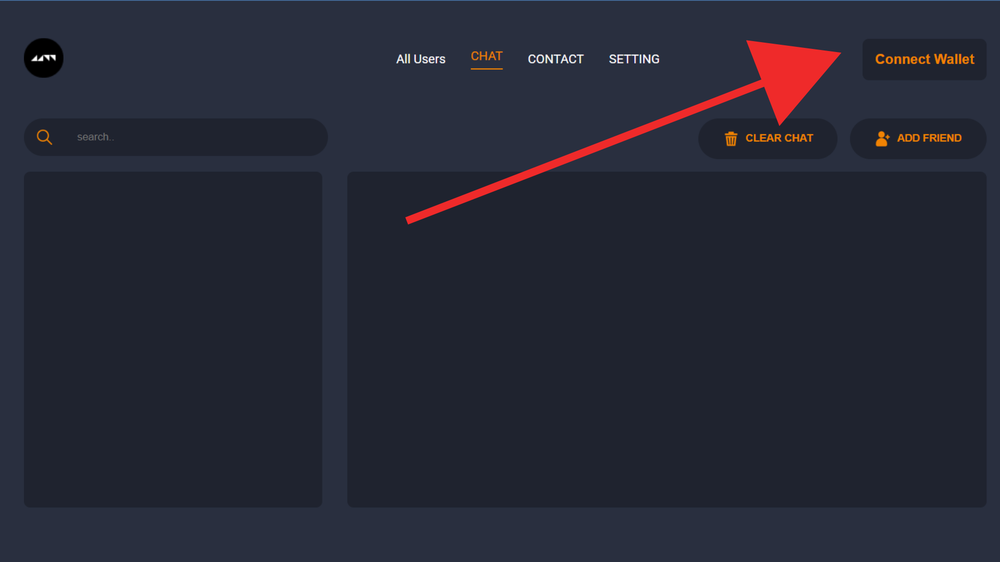
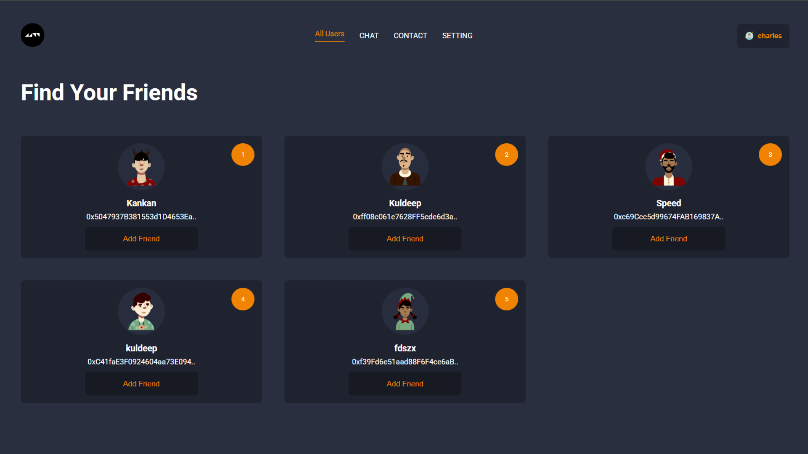
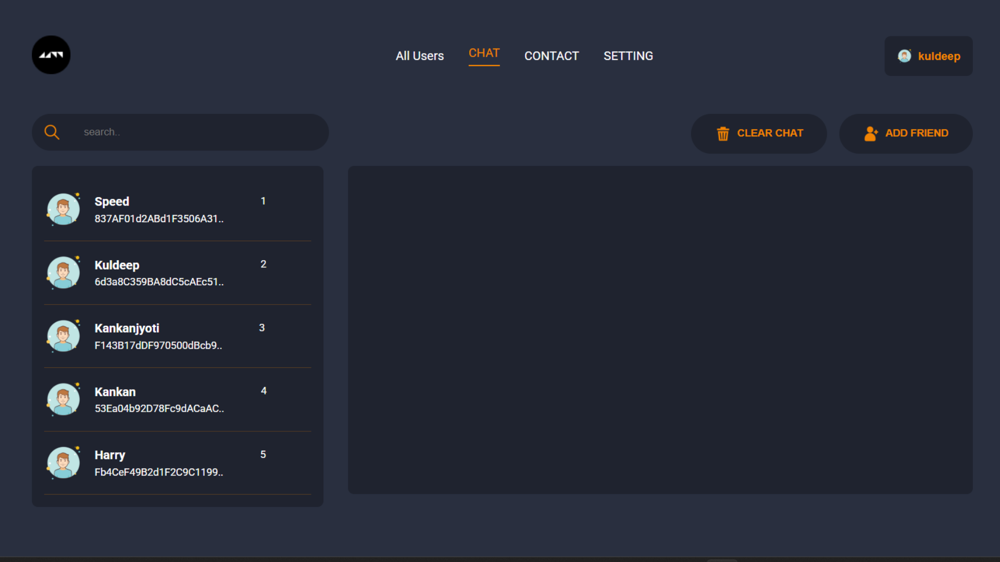

# 💬 Decentralized Real-Time Chat App

This is a real-time chat application powered by **blockchain technology**. Users can send messages instantly, and their chats are **recorded securely on the Ethereum blockchain** using a smart contract.

---

## 🌟 What Makes It Special?

- ✅ Chat in real time like WhatsApp or Telegram
- 🔐 Messages are stored on a **smart contract** (can’t be changed or deleted)
- 🧑‍💻 Each user is recognized by their **Ethereum wallet address**
- 🧠 Combines modern web technology with blockchain (Web3)

---

## 🧩 How It Works (in simple words)

### 1. **Frontend (React.js)**

- A clean and responsive user interface
- Users can connect their **MetaMask wallet**
- Once connected, they can start sending messages

### 2. **Smart Contract (Solidity)**

- Written in Solidity and deployed on a blockchain (e.g. Polygon or Ethereum testnet)
- Stores all messages and usernames securely
- Each message is linked to the sender's wallet address

### 3. **Web3 Connection**

- Uses **ethers.js** to communicate with the smart contract
- MetaMask signs the transactions so only the real user can send a message

---

## 🔐 How Messages Work on the Blockchain

When a user sends a message:

1. The frontend asks MetaMask to **sign and send a transaction**
2. The message is passed to the smart contract on-chain
3. The smart contract saves:
   - Who sent it (their wallet)
   - What they said
   - When they said it
4. Anyone can read the messages, but they can’t be changed or removed.

---

## 📸 App Demo

### 🆕 Getting Started (New Users)

When a new user visits the website, the first screen will prompt them to connect their wallet.

🪙 Steps to Create an Account:

1. Click on the "Connect Wallet" button at the top right corner.

2. After connecting, a "Create Account" option will appear.

3. Enter your name and your wallet address to register.

Once done, you will be redirected to the main chat interface where you can see other users by clicking add friend button. You can add them as a friend and interact with them.

### ➕ Add a Friend

Users can see all available users and their wallet addresses. By clicking on "Add Friend", a blockchain transaction is triggered that saves the friendship in the smart contract.

📸 All Users Page – Add Friend Feature

How it works:

1. You connect your wallet and are shown a list of users.

2. Each user card displays their name and partial wallet address.

3. Click the "Add Friend" button under any card.

   

### 💬 Chat Interface (After Account Creation)

After creating your account, you'll see all your added friends listed on the left-hand side. You can click any friend's name to start a conversation with them.

1. The chat area appears on the right side after selecting a friend.

2. You can also clear chat history or add more friends from the top-right section.

